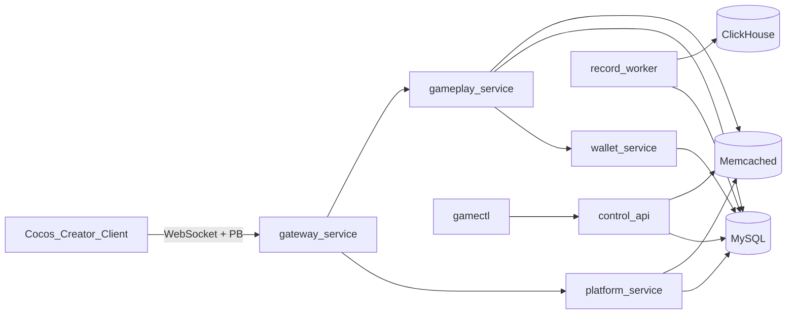
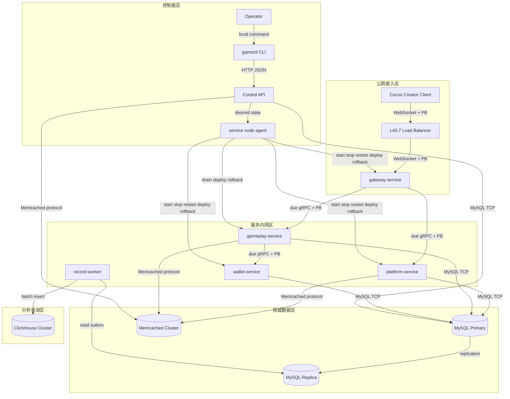
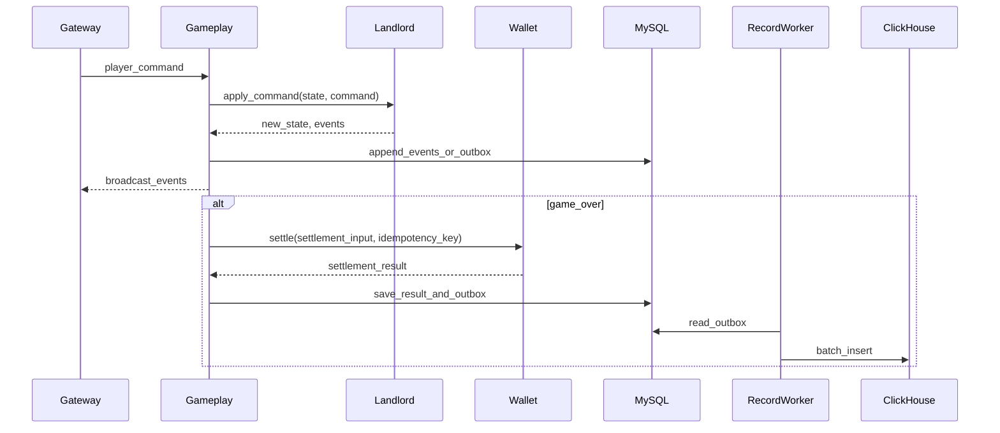

# 棋牌游戏服务端框架设计

## 目标与边界

本设计面向一个 Go 语言实现的棋牌游戏服务端。系统需要支持多个玩法，第一期只开发斗地主。后续可以在同一框架下扩展麻将、跑得快、掼蛋等玩法。

技术约束：

- 前端引擎：Cocos Creator。
- 客户端通信：WebSocket 长连接。
- 客户端业务协议：Protocol Buffers，简称 PB。
- 服务端语言：Go。
- 微服务框架：due。
- 内部 RPC：gRPC + PB。
- 持久化数据库：MySQL。
- 缓存：Memcached。
- 分析查询：ClickHouse。
- 架构形态：少量核心服务 + 清晰模块边界，后续按复杂度拆分微服务。
- 规模目标：支持百万 DAU，设计重点是水平扩展、房间状态归属、资产一致性、可观测性和故障恢复。

百万 DAU 不等于百万同时在线。容量评估应以峰值在线人数、每秒消息数、每秒开局数、结算 TPS、MySQL 写入 TPS 和网关长连接数为核心指标。

## 架构原则

核心原则：

- 网关无状态，支持水平扩展。
- Cocos Creator 客户端只连接 gateway-service，不直接访问内部业务服务。
- 客户端与 gateway-service 使用 WebSocket，业务消息使用 PB 编码。
- 内部在线服务基于 due 构建，服务间默认使用 gRPC + PB。
- 第一版合并部署，代码按领域模块化，避免过早拆分过多服务。
- 房间状态单写者，同一房间同一时刻只由一个 gameplay 节点处理。
- 玩法规则与房间生命周期解耦。
- 资产结算以 MySQL 为事实来源，并使用事务和幂等号保证一致性。
- Memcached 只作为缓存，不存放不可丢失的事实数据。
- ClickHouse 承接日志、回放查询、运营分析和风控分析，不作为线上交易事实来源。
- 牌局过程可追溯，关键操作以事件、流水或 outbox 形式落 MySQL。
- 服务之间通过明确协议通信，不共享数据库表作为隐式接口。

## 第一版服务边界

第一版不建议把所有逻辑都拆成独立微服务。采用“合并部署、模块化代码”的方式，降低开发、部署和排障成本，同时保留后续拆分能力。

建议第一版部署单元：

- `gateway-service`：客户端长连接入口。
- `platform-service`：合并 auth-user、lobby、config。
- `gameplay-service`：合并 match、room、game、landlord、bot。
- `wallet-service`：独立资产服务。
- `record-worker`：异步同步 MySQL outbox / 结构化日志到 ClickHouse。
- `gamectl` + control API：运维控制面，管理服务、配置、AB、灰度、更新和节点负载。

### gateway-service

客户端接入层，负责长连接、协议编解码、登录态校验、限流、请求路由和断线重连入口。网关不保存房间状态，只保存连接上下文和短期路由缓存。

职责：

- 建立和维护 TCP/WebSocket 连接。
- 校验 session，绑定 user_id 与 connection_id。
- 将客户端命令路由到 platform 或 gameplay。
- 将房间事件推送给客户端。
- 做基础限流和协议版本兼容。

### platform-service

合并账号、设备、登录会话、用户资料、大厅、场次配置和入场校验。该服务是典型请求响应型服务，状态轻，主要读写 MySQL 和 Memcached，第一版拆成多个服务收益不高。

职责：

- 登录、登出、token 校验。
- 用户资料读写。
- 设备绑定和基础风控信息记录。
- 返回玩法列表和场次配置。
- 校验用户金币、等级、封禁状态。
- 查询用户当前是否已有未完成房间。
- 管理入场门槛、底分、倍数、超时、机器人开关等配置读取。
- 会话、用户资料和热点配置可使用 Memcached 缓存。

后续拆分条件：

- 账号体系、设备风控、实名、封禁等逻辑复杂后，拆出 `auth-user-service`。
- 配置后台、灰度发布、审核流程复杂后，拆出 `config-service`。
- 大厅聚合视图成为独立高 QPS 热点后，拆出 `lobby-service`。

### gameplay-service

合并匹配、房间、玩法规则、斗地主实现和机器人补位。实时对局链路对延迟和状态一致性敏感，第一版将这些模块放在同一部署单元内更稳。

职责：

- 按玩法、场次、用户段位或金币区间维护匹配队列。
- 匹配成功后创建房间并选择 owner worker。
- 管理房间生命周期、座位、在线/离线、托管状态。
- 接收玩家命令，调用斗地主规则模块处理。
- 将规则事件广播给玩家。
- 在关键阶段写 MySQL 事件、结果或 outbox。
- 调用 wallet-service 完成结算。
- 超时后按配置引入机器人。
- 防止同一用户重复进入多个匹配队列。

约束：

- 匹配队列的事实状态由 gameplay-service 内存 owner 管理，不放入 Memcached。
- 用户是否正在匹配可以写入 MySQL 或短 TTL 缓存作为辅助校验，但不能以 Memcached 作为队列事实来源。
- 一个房间同一时刻只能有一个 owner 节点。
- 房间状态只允许 owner 节点修改。
- 客户端重连后必须根据 room_id 路由回 owner 节点。
- 节点故障时，未完成匹配允许客户端重新入队；已分配房间以 MySQL 房间记录和事件日志为准。

内部模块：

- `match`：匹配、分桌、机器人补位。
- `room`：房间 owner、座位、命令队列、广播、断线重连。
- `landlord`：斗地主规则引擎。
- `bot`：第一版简单机器人策略。

后续拆分条件：

- 匹配队列复杂、跨玩法调度压力变大后，拆出 `match-service`。
- 机器人策略复杂或资源消耗明显后，拆出 `bot-service`。
- 玩法规则需要独立团队维护或多语言沙箱后，再考虑拆出独立 `game-service`。

### wallet-service

负责金币、道具、账户流水和结算幂等。

职责：

- 账户余额查询。
- 对局结算扣加金币。
- 记录资产流水。
- 通过幂等号避免重复结算。
- 对外提供统一资产变更接口。

约束：

- 资产变更只能通过 wallet-service。
- 余额以 MySQL 为准。
- Memcached 中的余额只作为展示缓存，不能参与结算判断。

### record-worker

不单独做在线 `record-service`。记录能力以模块和异步 worker 形式存在：MySQL 保存线上事实，ClickHouse 保存查询分析副本。

职责：

- 从 MySQL outbox 或结构化日志读取待同步记录。
- 写入 ClickHouse 明细事件、回放查询表和运营分析宽表。
- 对同步失败的数据重试。
- 提供面向后台查询的 ClickHouse 数据模型。

约束：

- 不作为实时对局链路上的强依赖。
- 不作为结算事实来源。
- 不替代 MySQL 中的关键牌局结果、结算结果和幂等记录。

### gamectl 与 control API

`gamectl` 是控制面 CLI，调用后台控制面 API，不直接修改进程或数据库文件。

覆盖能力：

- 服务管理。
- 配置更新。
- AB 测试。
- 功能灰度发布。
- 不停服滚动更新计划。
- 服务器状态和负载查看。

控制面数据以 MySQL 为权威存储，Memcached 只缓存配置和规则快照。

## 总体调用链路



## 网络架构图

网络上按公网接入区、服务内网区、数据区、分析区和控制面区划分。客户端只进入 `gateway-service`，内部服务和数据组件不暴露公网。



网络边界：

| 区域 | 组件 | 暴露范围 | 说明 |
|---|---|---|---|
| 公网接入区 | LB、`gateway-service` | 对客户端开放 | 只开放 WebSocket + PB 入口。 |
| 服务内网区 | `platform-service`、`gameplay-service`、`wallet-service`、`record-worker` | 仅内网访问 | 在线服务使用 due gRPC + PB，worker 使用内部任务访问，不直接暴露给客户端。 |
| 权威数据区 | MySQL、Memcached | 仅服务内网和控制面访问 | MySQL 存事实，Memcached 只做缓存。 |
| 分析查询区 | ClickHouse | 仅 worker、后台和分析任务访问 | 用于回放、运营、风控和历史查询。 |
| 控制面区 | `gamectl`、Control API、node agent | 运维入口受控开放 | 所有发布、回滚、配置、AB、灰度操作必须鉴权和审计。 |

安全要求：

- 客户端不能直接访问 `platform-service`、`gameplay-service`、`wallet-service`、MySQL、Memcached 和 ClickHouse。
- Control API 不能公网裸露，必须经过 VPN、堡垒机、内网网关或等价访问控制。
- MySQL 主库只接受业务写入和控制面写入；分析查询优先读副本或 ClickHouse。
- `record-worker` 写 ClickHouse 失败时回退到 MySQL outbox 重试，不阻塞实时对局。
- `gameplay-service` 发布和回滚前必须先 drain：停止接新房，等待房间结束或迁移 owner。

## 客户端与协议

前端使用 Cocos Creator。客户端只与 `gateway-service` 建立 WebSocket 长连接，内部服务不暴露给客户端。

协议要求：

- 传输层使用 WebSocket。
- 业务协议使用 Protocol Buffers，简称 PB。
- 每个客户端消息包含 `request_id`、`cmd`、`seq`、`payload` 和协议版本。
- `payload` 为具体业务 PB 消息，例如登录、进入大厅、匹配、叫地主、出牌、托管、断线重连。
- 服务端推送事件包含 `event_id`、`seq`、`event_type`、`payload` 和 `server_time`。
- Gateway 负责 WebSocket 连接管理、PB 封包拆包、协议版本校验、鉴权和路由。
- Platform、Gameplay、Wallet 等内部服务只处理已经解析后的领域请求，不直接依赖 Cocos Creator。

协议兼容策略：

- PB 字段只追加不复用字段号。
- 删除字段时保留 reserved 字段号和字段名。
- 客户端和服务端都必须携带协议版本。
- Gateway 根据客户端版本做兼容适配或拒绝过旧版本。
- 关键命令必须支持幂等或去重，避免断线重连后重复操作。

建议目录：

```text
api/proto/
  common.proto
  auth.proto
  lobby.proto
  match.proto
  room.proto
  landlord.proto
  wallet.proto
```

## 服务连接方式与协议

不同链路使用不同协议，避免把客户端协议、内部服务协议和运维控制面协议混在一起。

| 连接 | 协议 / 方式 | 说明 |
|---|---|---|
| Cocos Creator -> `gateway-service` | WebSocket + PB | 客户端唯一入口，承载长连接、推送和断线重连。 |
| `gateway-service` -> `platform-service` | due gRPC + PB | 登录校验、大厅、配置、入场校验等请求响应型调用。 |
| `gateway-service` -> `gameplay-service` | due gRPC + PB，必要时内部长连接 RPC | 玩家命令路由到房间 owner，要求低延迟和明确超时。 |
| `gameplay-service` -> `wallet-service` | due gRPC + PB | 对局结算链路，必须携带 `idempotency_key`。 |
| `gameplay-service` -> MySQL | MySQL TCP | 写房间摘要、关键事件、结算结果和 outbox。 |
| `wallet-service` -> MySQL | MySQL TCP | 写资产账户、资产流水和结算幂等记录。 |
| `platform-service` -> MySQL | MySQL TCP | 写用户、会话、配置和大厅相关权威数据。 |
| `platform-service` -> Memcached | Memcached 协议 | 缓存用户资料、会话校验、配置和大厅聚合视图。 |
| `record-worker` -> MySQL | MySQL TCP | 读取 outbox、关键事件和同步游标。 |
| `record-worker` -> ClickHouse | ClickHouse HTTP 或 Native TCP | 批量写分析、回放和运营查询数据。 |
| `gamectl` -> Control API | HTTP JSON | 运维 CLI 面向人工使用和调试，不使用 PB。 |
| Control API -> MySQL | MySQL TCP | 配置、AB、灰度、服务状态和更新计划的权威写入。 |
| Control API -> Memcached | Memcached 协议 | 刷新或删除配置、AB 和灰度规则缓存。 |

协议结论：

- 客户端链路使用 WebSocket + PB。
- 内部在线服务链路默认使用 due + gRPC + PB。
- 控制面链路使用 HTTP JSON。
- 异步分析链路使用 MySQL outbox -> record-worker -> ClickHouse。
- 缓存链路使用 Memcached，且只做缓存，不做事实存储。

内部服务调用要求：

- 所有 gRPC 请求必须携带 `request_id`、`trace_id`、`user_id` 和超时。
- 任何会改变资产、房间或配置状态的请求必须携带幂等键或版本号。
- 服务边界返回统一错误码，不暴露 SQL、堆栈和内部实现细节。
- Gateway 负责把客户端 PB 消息转换为内部服务请求，内部服务不直接依赖 Cocos Creator。
- due 中间件统一承载日志、指标、链路追踪、超时、限流、恢复和错误码转换。

## 多玩法模型

玩法不能写死在房间流程中。`gameplay-service` 内部的 room 模块只管理通用房间流程，玩法规则由 landlord 等规则模块实现。部署上可以合并，代码边界必须清晰。

建议抽象：

- `GameDefinition`：玩法元信息，包括玩法编号、人数、版本和配置校验。
- `GameState`：对局状态快照，需要可序列化、可恢复、可回放。
- `Command`：玩家命令，例如叫地主、抢地主、出牌、过牌、托管。
- `Event`：规则事件，例如发牌、轮转、出牌成功、倍数变化、对局结束。
- `RuleEngine`：输入当前状态和命令，输出新状态与事件。
- `SettlementInput`：规则引擎输出给钱包服务的结算输入。

推荐流程：



## 斗地主第一期范围

第一期只做经典三人斗地主，建议范围如下。

必做：

- 快速匹配。
- 经典三人玩法。
- 发牌、叫地主或抢地主。
- 出牌、过牌、牌型校验、牌型比较。
- 托管和出牌超时。
- 断线重连。
- 基础金币结算。
- 牌局事件记录和结果记录。
- 简单机器人补位。

可配置：

- 底分。
- 入场金币上下限。
- 叫地主/抢地主模式。
- 明牌开关。
- 加倍开关。
- 操作超时时间。
- 机器人补位时间。

暂不建议第一期开发：

- 比赛场。
- 好友房。
- 完整任务系统。
- 复杂机器人策略。
- 复杂风控系统。
- 跨玩法排行榜。

## 房间状态归属

gameplay-service 是有状态服务，需要明确房间归属策略。

设计：

- 匹配成功后，由 gameplay-service 内部调度器创建房间。
- 调度器基于一致性哈希、节点负载或分片规则选择 gameplay 节点或分片 worker。
- `room_id -> room_node` 的映射写入短 TTL 注册表。
- Gateway 根据映射将玩家命令路由到 owner 节点。
- owner 节点定期上报房间心跳。
- 节点故障时，根据最近快照和事件日志恢复。

恢复策略：

- 房间开始、关键阶段切换、结算前写入事件日志。
- 长对局可以定期写快照；斗地主对局较短，事件日志通常足够。
- 节点故障后，新 owner 加载事件日志重放状态。
- 恢复期间客户端进入等待状态，避免重复结算。

不停服更新要求：

- gameplay 节点更新前必须先停止接收新房间。
- 已有房间优先等待自然结束。
- 长时间未结束的房间需要按事件日志和最近状态迁移 owner。
- 更新期间 Gateway 必须能根据最新映射重新路由玩家命令。

## MySQL 数据设计方向

MySQL 是事实来源。第一版可以逻辑分库，后续按规模拆物理库。

建议领域：

- 用户库：用户、设备、登录会话。
- 资产库：账户、资产流水、冻结记录、结算幂等表。
- 对局库：房间、牌局结果、事件日志、回放索引。
- 配置库：玩法、场次、版本化配置。
- 控制面库：配置、AB、灰度、服务状态、更新计划、节点负载。

关键表方向：

- `users`：用户基础信息。
- `user_sessions`：登录会话。
- `wallet_accounts`：用户资产账户。
- `wallet_ledger`：资产流水。
- `settlement_idempotency`：结算幂等记录。
- `game_rooms`：房间概要。
- `game_rounds`：单局结果。
- `game_events`：牌局事件日志。
- `game_configs`：玩法和场次配置。
- `record_outbox`：待同步到 ClickHouse 的事件。
- `control_configs`：控制面配置。
- `control_ab_tests`：AB 实验定义。
- `control_rollouts`：灰度规则。
- `control_services`：服务状态。
- `control_update_plans`：滚动更新计划。
- `control_service_versions`：服务版本和制品信息。
- `control_releases`：发布记录。
- `control_rollbacks`：回滚记录。
- `control_node_loads`：服务器状态和负载。

设计要求：

- 所有核心表包含 `created_at`、`updated_at`。
- 大表包含 `shard_key` 或可用于分片的业务键。
- 资产流水必须包含全局唯一 `transaction_id`。
- 结算请求必须包含 `idempotency_key`。
- 对局数据按时间和玩法预留归档策略。

## ClickHouse 查询分析方向

ClickHouse 用于查询、回放检索、运营分析和风控分析，不参与实时对局和资产结算。

适合写入：

- 牌局明细事件。
- 玩家行为日志。
- 房间生命周期日志。
- 对局结果宽表。
- AB 实验曝光和转化事件。
- 灰度命中记录。
- 服务状态和负载历史。

同步方式：

- gameplay-service 或 wallet-service 先把关键事实写入 MySQL。
- record-worker 从 MySQL outbox 或结构化日志读取待同步数据。
- record-worker 批量写入 ClickHouse。
- 同步失败时记录重试状态，不影响实时对局主链路。

约束：

- ClickHouse 中的数据允许延迟。
- ClickHouse 不是结算、补偿和纠纷处理的唯一来源。
- 关键事实必须能从 MySQL 回溯。

## Memcached 使用规范

Memcached 采用 cache-aside 模式：读缓存未命中再查 MySQL，写入 MySQL 成功后删除或刷新缓存。

适合缓存：

- 用户基础资料。
- session 校验结果。
- 玩法和场次配置。
- 大厅聚合视图。
- 短 TTL 的用户匹配展示状态。
- AB 实验和灰度规则快照。
- 控制面配置快照。
- 频控计数。

不适合缓存：

- 资产事实余额。
- 结算结果事实。
- 房间实时权威状态。
- 匹配队列成员和分桌事实状态。
- 牌局事件日志。
- ClickHouse 同步游标。

Key 命名：

- `user:profile:{uid}`
- `user:session:{token}`
- `game:config:{game_code}:{version}`
- `control:config:{key}:{version}`
- `ab:test:{feature_key}:{version}`
- `rollout:{feature_key}:{version}`
- `lobby:rooms:{game_code}:{client_version}`
- `match:status:{uid}`
- `rate:limit:{scope}:{id}`

要求：

- 所有 key 必须有 TTL。
- TTL 增加随机抖动，降低雪崩风险。
- 热点配置支持启动预热。
- 缓存值必须可重新从 MySQL 构建。
- 不在缓存中保存明文密码、token 原文、完整手牌等敏感数据。

## 百万 DAU 扩展策略

容量指标：

- DAU。
- 峰值 CCU。
- 每秒客户端消息数。
- 每秒开局数。
- 每秒结算数。
- MySQL QPS/TPS。
- Memcached QPS。
- ClickHouse 写入延迟和查询耗时。
- Gateway 单节点连接数。
- Gameplay 单节点房间数和消息吞吐。

扩展方向：

- Gateway 按连接数水平扩容。
- Platform 以无状态服务水平扩容。
- Gameplay 按玩法、场次和房间分片水平扩容。
- Wallet 按 user_id 分片或分库，先保证事务边界清晰。
- Record-worker 批量写 ClickHouse，查询分析和线上主链路解耦。

降级策略：

- Control API 或配置读取异常时使用本地最近配置。
- ClickHouse 写入短暂失败时写入 MySQL outbox 表重试，不影响实时对局和结算。
- Memcached 不可用时回源 MySQL，并触发限流保护。
- Wallet 不可用时禁止新开局或暂停结算，不能本地绕过扣款。
- Control API 不可用时禁止发布新配置、AB 和灰度规则，服务继续使用最近一次已生效配置。

## 可观测性

每个服务必须输出：

- 结构化日志。
- Prometheus 风格指标。
- 请求 ID 和链路 ID。
- 关键业务事件。
- 慢查询和慢 RPC。

关键告警：

- Gateway 连接数异常。
- Gameplay 节点房间数过高。
- 匹配等待时间过长。
- 结算失败率升高。
- MySQL 慢查询和连接池耗尽。
- Memcached 命中率骤降。
- ClickHouse 同步延迟升高。
- 断线重连率异常。
- CLI 控制面操作失败率升高。

## 安全与风控基础

第一期只做基础能力：

- 登录态校验。
- 单用户多连接策略。
- 基础频控。
- 防重复匹配。
- 结算幂等。
- 敏感日志脱敏。
- 管理接口鉴权。
- CLI 操作鉴权、审计和危险操作确认。

复杂作弊检测和行为模型可以后置，但事件日志必须从第一期保留足够信息。

## CLI 控制面

项目提供 `gamectl` 作为控制面 CLI。CLI 调用后台 Control API，由服务端统一执行服务管理、配置发布、AB、灰度、滚动更新计划和节点状态查询。

CLI 不直接修改生产数据库文件或服务器进程。所有写操作必须进入 Control API，落 MySQL 审计，并按需要刷新 Memcached 缓存。

第一版能力：

- `gamectl status`：查看控制面和服务状态。
- `gamectl service list/action`：查看服务状态，发起 start、stop、restart。
- `gamectl config list/get/set`：管理配置项。
- `gamectl abtest list/create`：管理 AB 实验。
- `gamectl rollout list/create`：管理功能灰度。
- `gamectl update list/plan`：创建不停服滚动更新计划。
- `gamectl version list/register`：登记和查询服务版本。
- `gamectl release list/deploy`：发布指定服务版本。
- `gamectl rollback`：回滚服务到指定历史版本。
- `gamectl nodes`：查看服务器状态和负载。

生产落地要求：

- Control API 需要鉴权和 operator 审计。
- 配置、AB、灰度规则以 MySQL 为权威存储。
- 服务版本、发布记录和回滚记录以 MySQL 为权威存储。
- 发布前必须先登记版本制品，记录 artifact 和 checksum。
- 回滚必须显式指定目标版本和原因，不能隐式猜测。
- Memcached 只缓存规则快照。
- 服务节点通过 agent 或编排系统执行具体服务动作。
- gameplay-service 支持优雅下线、停止接新房和房间迁移。

## 里程碑建议

第一阶段：框架骨架。

- 服务目录和协议定义。
- Gateway 到 Platform 的基础链路。
- MySQL 和 Memcached 基础访问层。
- 配置加载和日志指标。
- Control API 与 `gamectl` CLI 骨架。

第二阶段：斗地主规则。

- 斗地主规则引擎。
- 表驱动测试。
- 房间流程集成测试。

第三阶段：匹配与房间。

- 快速匹配。
- 房间 owner 管理。
- 断线重连。
- 机器人补位。
- gameplay-service 优雅下线和滚动更新支持。

第四阶段：资产与记录。

- 钱包结算。
- 资产流水。
- MySQL 牌局关键事件和 outbox。
- record-worker 同步到 ClickHouse。
- ClickHouse 回放查询和运营分析宽表。

第五阶段：压测与扩展。

- 单服务压测。
- 全链路压测。
- 故障恢复演练。
- 容量模型校准。

第六阶段：控制面增强。

- MySQL repository 替换控制面内存 store。
- 配置 schema 校验。
- AB 和灰度规则评估 SDK。
- operator 鉴权和审计。
- 节点 agent 上报负载并执行服务动作。
