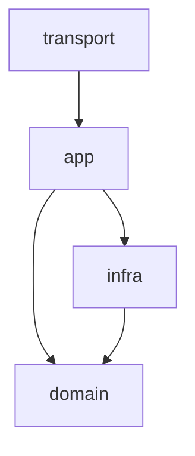

# Go 项目结构与编码规范

## 目标

本文定义棋牌游戏服务端的 Go 语言规范。目标是让多服务、多玩法代码保持清晰边界、可测试、可扩展，并能支撑高并发房间服务和资产一致性要求。

适用范围：

- 微服务进程。
- 斗地主及后续玩法规则。
- MySQL、Memcached、RPC、消息协议等基础设施适配。
- 单元测试、集成测试和压测代码。

## Go 版本与基础工具

要求：

- 统一使用团队指定的 Go 稳定版本。
- 所有代码必须通过 `gofmt`。
- 提交前必须运行 `go test ./...`。
- 服务代码必须通过 `go vet ./...`。
- 引入第三方依赖必须说明用途，避免为小工具引入大依赖。

建议命令：

```bash
gofmt -w .
go vet ./...
go test ./...
```

## 仓库结构

推荐使用单仓库多服务结构。

```text
cmd/
  gateway-service/
    main.go
  auth-user-service/
    main.go
  lobby-service/
    main.go
  match-service/
    main.go
  room-service/
    main.go
  game-service/
    main.go
  wallet-service/
    main.go
  record-service/
    main.go
internal/
  app/
  domain/
  infra/
  transport/
pkg/
  gamekit/
  landlord/
api/
configs/
migrations/
docs/
```

目录职责：

- `cmd/`：每个服务的启动入口，只做配置加载、依赖装配和启动。
- `internal/app/`：应用用例层，编排领域逻辑和基础设施。
- `internal/domain/`：领域模型、领域服务、接口定义和核心规则。
- `internal/infra/`：MySQL、Memcached、RPC、日志、指标等实现。
- `internal/transport/`：HTTP、WebSocket、TCP、gRPC 等协议适配。
- `pkg/gamekit/`：可复用玩法框架能力，例如牌、牌组、规则接口。
- `pkg/landlord/`：斗地主规则引擎。若不希望对外暴露，可放入 `internal/domain/game/landlord`。
- `api/`：对外协议定义。
- `configs/`：配置模板，不保存生产密钥。
- `migrations/`：MySQL 迁移脚本。
- `docs/`：架构、规范、运维和协议文档。

## 包命名规范

要求：

- 包名使用小写单词，不使用下划线。
- 包名短小明确，例如 `wallet`、`room`、`landlord`。
- 禁止使用 `common`、`utils`、`helper` 承载业务逻辑。
- 避免包之间循环依赖。
- 领域层不能依赖基础设施层。

可接受的工具包命名：

- `clock`：时间抽象。
- `idgen`：ID 生成。
- `codec`：协议编解码。
- `retry`：重试策略。

如果一个工具包开始包含业务概念，应移动到对应领域包。

## 分层规范

推荐依赖方向：



说明：

- `transport` 负责协议解析和响应转换。
- `app` 负责用例编排、事务边界、权限校验、幂等处理。
- `domain` 负责业务规则，不直接访问 MySQL、Memcached 或网络。
- `infra` 实现 domain 或 app 定义的接口。

禁止：

- 在 `domain` 中直接使用 SQL。
- 在 `domain` 中直接访问 Memcached。
- 在规则引擎中读取环境变量。
- 在 handler 中堆叠复杂业务规则。

## 服务入口规范

`cmd/<service>/main.go` 只允许做启动装配。

职责：

- 加载配置。
- 初始化日志、指标和链路追踪。
- 初始化 MySQL、Memcached 和 RPC 客户端。
- 装配 app service。
- 启动 transport server。
- 监听系统信号并优雅退出。

不允许：

- 写业务规则。
- 写 SQL 细节。
- 写玩法逻辑。
- 写复杂 goroutine 编排。

## 配置规范

要求：

- 配置统一从配置模块加载。
- 业务逻辑不直接读取环境变量。
- 配置结构体必须有明确字段名和默认值。
- 密码、token、私钥不能提交到 Git。
- 生产和本地配置分离。

示例字段：

```text
service.name
service.env
mysql.dsn
mysql.max_open_conns
mysql.max_idle_conns
memcached.servers
room.max_rooms_per_node
room.command_timeout
```

## context 使用规范

所有跨边界调用必须携带 `context.Context`。

必须传递：

- request_id。
- trace_id。
- user_id。
- deadline 或 timeout。
- idempotency_key，如果该请求会改变资产或状态。

要求：

- 不把 `context.Context` 存到结构体中。
- 不使用 nil context。
- 后台任务使用 `context.Background()` 派生，并明确退出条件。
- 服务关闭时通过 context 取消 goroutine。

## 错误处理规范

错误分三层：

- 领域错误：业务规则错误，例如金币不足、非法出牌、不是当前玩家。
- 基础设施错误：MySQL、Memcached、网络、序列化错误。
- 传输错误：协议错误、参数错误、鉴权失败。

要求：

- 使用 `%w` 包装底层错误。
- 服务边界把内部错误转换成明确错误码。
- 客户端只看到可理解的业务错误，不看到 SQL 或内部堆栈。
- 日志记录内部错误和上下文。
- 不用字符串匹配判断错误类型。

错误码建议：

```text
OK
INVALID_ARGUMENT
UNAUTHENTICATED
PERMISSION_DENIED
NOT_FOUND
CONFLICT
RATE_LIMITED
ROOM_NOT_FOUND
ROOM_NOT_OWNER
GAME_INVALID_COMMAND
WALLET_INSUFFICIENT_BALANCE
WALLET_DUPLICATE_SETTLEMENT
INTERNAL
UNAVAILABLE
```

## 日志规范

要求使用结构化日志。

每条关键日志至少包含：

- service。
- env。
- request_id。
- trace_id。
- user_id，如果有。
- room_id，如果有。
- game_id，如果有。
- error_code，如果失败。

禁止记录：

- 明文密码。
- token 原文。
- 完整手牌。
- 支付凭证。
- 用户隐私字段。

推荐记录：

- 登录成功/失败。
- 匹配入队/出队。
- 房间创建/关闭。
- 玩家断线/重连。
- 结算请求/结果。
- 幂等冲突。
- MySQL 慢查询。
- Memcached 回源。

## MySQL 编码规范

要求：

- 所有 SQL 走 repository 或 DAO 层。
- 使用连接池，并按服务配置最大连接数。
- 所有写操作设置超时。
- 资产变更必须在事务中完成。
- 结算必须使用幂等号。
- 不在循环中无界执行 SQL。
- 查询必须考虑索引。

事务规范：

- 事务边界放在 app 层。
- 事务内只做必要的数据库操作。
- 不在事务内调用外部 RPC。
- 事务失败必须返回明确错误。

资产结算建议流程：

1. 检查 `idempotency_key` 是否已处理。
2. 锁定相关账户行。
3. 校验余额。
4. 写入资产流水。
5. 更新余额。
6. 写入幂等结果。
7. 提交事务。

## Memcached 编码规范

要求：

- 使用 cache-aside。
- 所有 key 必须有 TTL。
- key 统一由专门函数生成。
- 缓存值必须可从 MySQL 重建。
- 缓存错误不应直接导致核心流程失败，除非该缓存承担频控或安全职责。
- 缓存 miss 回源必须有并发抑制，避免击穿。

Key 生成规则：

```text
{domain}:{entity}:{id}
{domain}:{entity}:{id}:{version}
```

示例：

```text
user:profile:10001
user:session:hash
game:config:landlord:v12
lobby:rooms:landlord:android_1_0
```

## 并发规范

房间服务优先使用 actor 或消息循环模型。

建议：

- 每个房间由一个 goroutine 或一个分片 worker 串行处理命令。
- 玩家命令进入房间队列。
- 房间内部状态只在 owner goroutine 中修改。
- 对外广播通过异步队列发送。
- 慢操作不能阻塞房间主循环。

谨慎使用：

- 全局锁。
- 共享 map。
- 无缓冲 channel 的复杂链路。
- 无退出条件的 goroutine。

必须做到：

- goroutine 有生命周期管理。
- channel 关闭由发送方负责。
- 定时器及时停止。
- 高并发路径避免频繁分配大对象。

## 房间和玩法代码规范

room-service 只处理通用流程：

- 创建房间。
- 玩家入座。
- 玩家连接状态。
- 命令队列。
- 超时和托管。
- 广播事件。
- 结算编排。

玩法规则只处理规则：

- 当前玩家是否合法。
- 命令是否合法。
- 牌型是否成立。
- 状态如何变化。
- 产生哪些事件。
- 如何计算结算输入。

规则引擎要求：

- 输入相同状态和命令，输出必须确定。
- 不直接访问数据库。
- 不直接发送网络消息。
- 不依赖当前系统时间；需要时间时由调用方传入。
- 必须容易做表驱动测试。

## API 与协议规范

客户端协议应保持版本化。

要求：

- 每个请求有 `request_id`。
- 每个需要用户身份的请求带登录态。
- 每个改变状态的请求具备去重能力。
- 服务端响应包含明确错误码。
- 推送事件包含递增序号，支持断线补偿。

事件建议字段：

```text
event_id
room_id
game_id
seq
event_type
payload
server_time
```

## 测试规范

### 单元测试

必须覆盖：

- 斗地主牌型识别。
- 牌型大小比较。
- 非法出牌。
- 叫地主/抢地主流程。
- 加倍配置。
- 结算倍数。
- 托管决策边界。

要求：

- 使用表驱动测试。
- 测试名称描述场景。
- 不依赖真实 MySQL 和 Memcached。
- 时间和随机数通过接口注入。

### 集成测试

必须覆盖：

- 登录到进入大厅。
- 匹配到创建房间。
- 完整斗地主一局。
- 断线重连。
- 结算成功。
- 重复结算幂等。
- Memcached miss 后回源。

### 压测

分阶段执行：

- 斗地主规则引擎单进程吞吐。
- 单 room 节点可承载房间数。
- Gateway 长连接数。
- 匹配队列吞吐。
- Wallet 结算 TPS。
- MySQL 写入 TPS。
- Memcached 命中率和 QPS。

## 代码评审清单

提交前检查：

- 是否通过 `gofmt`、`go vet`、`go test ./...`。
- 是否新增了必要测试。
- 是否有 context 超时。
- 是否有明确错误码。
- 是否误记录敏感信息。
- 是否把资产事实写入缓存。
- 是否在规则引擎中引入基础设施依赖。
- 是否有 goroutine 泄漏风险。
- 是否有重复结算风险。
- 是否有无界队列或无界重试。

## 文档规范

新增服务或玩法时必须补充：

- 服务职责。
- 依赖关系。
- 配置项。
- API 或事件协议。
- MySQL 表结构。
- Memcached key。
- 错误码。
- 测试说明。

玩法文档必须说明：

- 人数。
- 状态机。
- 命令列表。
- 事件列表。
- 结算规则。
- 可配置项。
- 暂不支持的能力。
